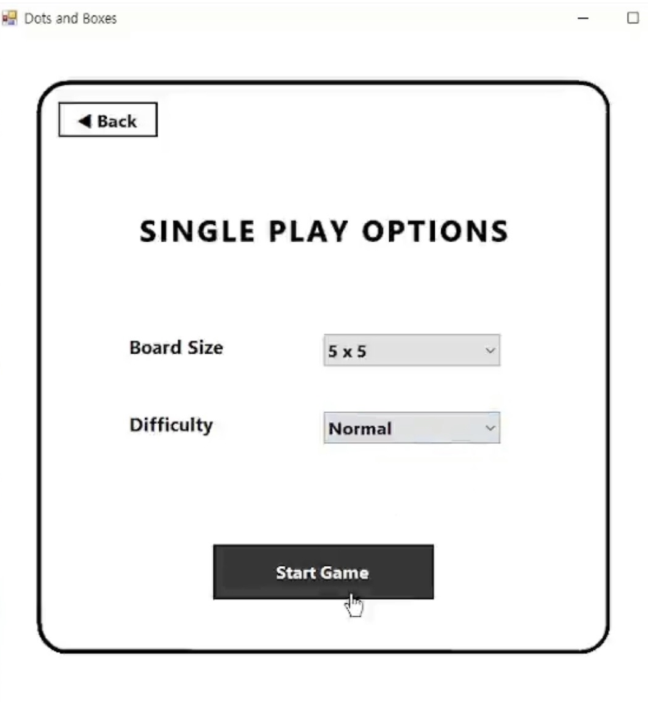
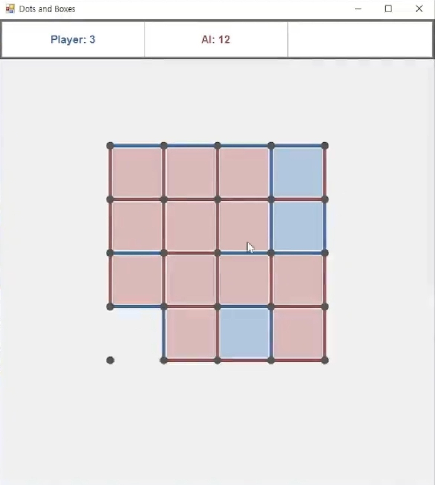
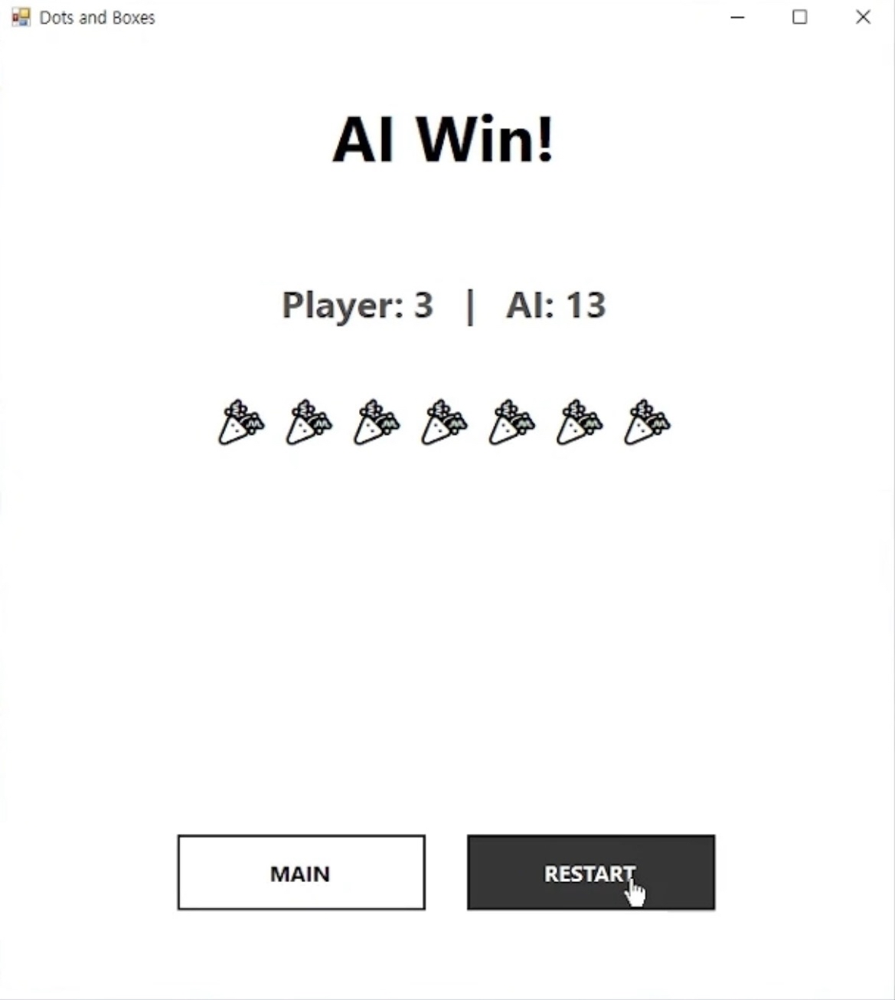
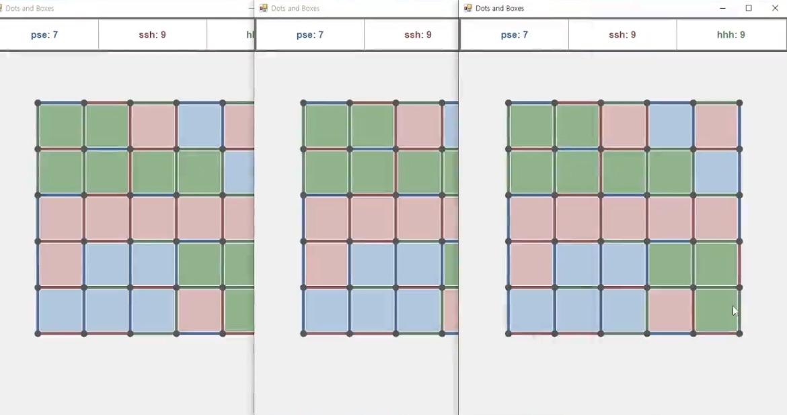

# 📘 Single Player & Detailed Screenshots

본 문서는 DotBoxOnline의 **싱글 플레이(AI)** 및
게임 모드별 상세 화면을 정리한 문서입니다.

---

## 🧠 Single Player (AI)

### 1️⃣ 싱글 플레이 옵션 설정

* 보드 크기 선택
* AI 난이도 선택 (Easy / Normal / Hard)

---

### 2️⃣ 싱글 플레이 진행

* 서버 판정 기반 게임 진행
* AI 난이도별 수 선택 전략 적용

---

### 3️⃣ 싱글 플레이 결과

* Player vs AI 결과 화면

---

## 🤖 AI Difficulty Logic

### Easy

* 가능한 선 중 무작위 선택

### Normal

* 박스 완성 가능 여부 우선 판단
* 완성 가능 시 즉시 마무리

### Hard

* **Minimax 알고리즘 기반**
* 상대의 다음 수까지 고려한 최적 수 선택

---

## 🌐 Multiplayer (Reference)

멀티플레이 핵심 화면은 메인 README에 요약되어 있으며,
본 문서에서는 참고용으로만 포함합니다.

---

## 📎 관련 문서

* 메인 소개: `README.md`
* 프로토콜 문서: `docs/protocols.md`
